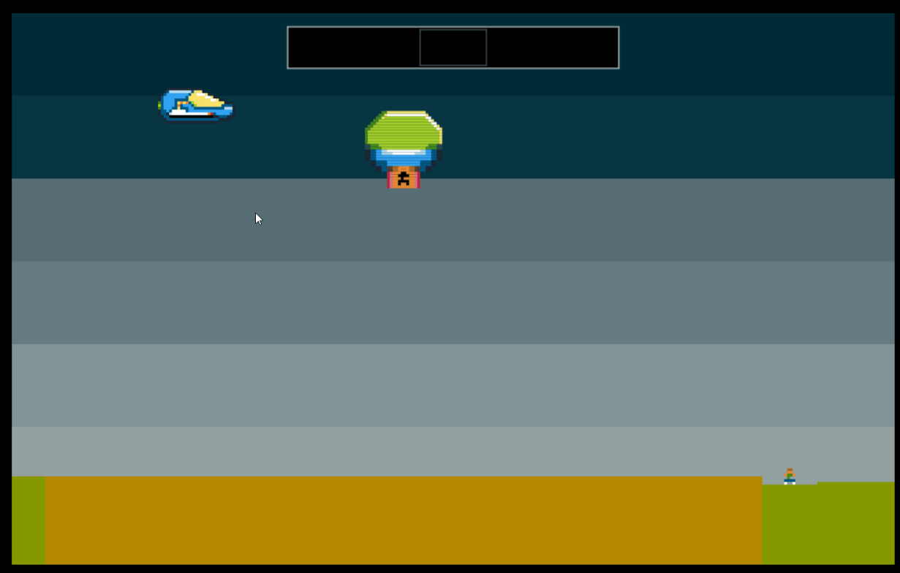

# oK Defender Clone

A clone of the classic DEFENDER game for Atari, written with [iKe](https://github.com/JohnEarnest/ok/tree/gh-pages/ike).

You can play this version at: http://games.tangentcode.com/ld49/ike/ike.html?key=UyV8RAct
Arrows to move, space to shoot.

Sadly, crashes about half the time when the aliens reach ground level.
